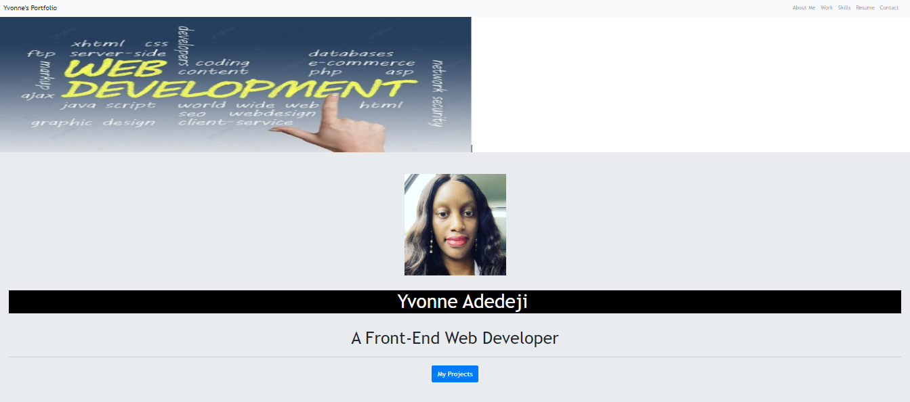

# Bootstrap-Portfolio

## Description
Portfolio for Yvonne Adedeji - Front-End Web Developer.
Recreate my personal portfolio using Bootstrap to showcase my projects. 

## Prerequisites
N/A

## Criteria
Using Bootstrap, recreate your portfolio site with the following items: The website should include the following bootstrap components:

* A Navigation bar and a navigation menu at the top.
* Include links that are applicable to your portfolio. Links should navigate to the appropriate sections
* A hero section
* A jumbotron featuring your picture, your name, and any other information you'd like to include.
* A work section that displays your work in grid.
Use bootstrap cards for each project.The description should give a brief overview of the work.
* A skills section
* An "About Me" section
* A footer section.
* All hyperlinks should have a hover effect.
* All buttons should display a box shadow upon hover.
* Your Bootstrap solution should minimize use of media queries.

## Technologies Used
Built with:
This portfolio was created using
* HTML
* CSS
* (Bootstrap)

## Installation
N/A

## Usage
N/A

## Project Link
Application can can be viewed here: 
* [Live](https://yvonnesarah.github.io/Bootstrap-Portfolio/)

* [Repository](https://github.com/yvonnesarah/Bootstrap-Portfolio)

## Screenshot(S)
Bootstrap Portfolio - Hero Section

Bootstrap Portfolio - About Me Section

Bootstrap Portfolio - Projects Section

Bootstrap Portfolio - Skills Section

Bootstrap Portfolio - CV / Contact Me Section

## Credit
N/A

## Licence
Please refer to the LICENSE in the repo.

